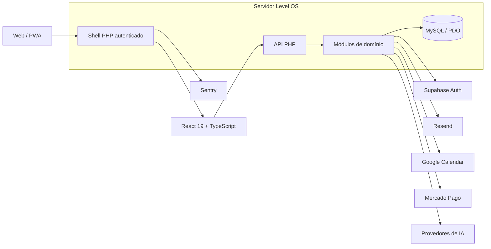

<p align="center">
  
</p>

<h1 align="center">Level OS</h1>

<p align="center">
  <strong>Seu sistema operacional pessoal para finanças, rotina, treinos, alimentação e evolução.</strong>
</p>

<p align="center">
  Uma plataforma web self-hosted, multiusuário e instalável como PWA, criada para transformar dados do dia a dia em decisões, consistência e progresso mensurável.
</p>

<p align="center">
  <a href="https://github.com/MaxKsp/level-os/actions/workflows/tests.yml"></a>
  
  
  
  
  
  
  
</p>

---

## Visão do produto

O **Level OS** reúne os principais pilares da vida pessoal em uma experiência única. Em vez de manter finanças, agenda, exercícios, alimentação e metas em aplicativos isolados, a plataforma conecta esses contextos em um painel privado, progressivo e assistido por IA.

| Pilar | O que o Level OS entrega |
|---|---|
| **Visão geral** | Resumo do dia, patrimônio, rotina, treino, cofrinhos, XP e atalhos contextuais |
| **Finanças** | Contas, cartões, rendas, despesas, transferências, OFX, parcelamentos, extrato, indicadores e IR |
| **Rotina** | Agenda, tarefas, recorrência, prioridades, visão temporal e integração opcional com Google Calendar |
| **Treinos** | Fichas, exercícios, sessões, carga, cardio, medidas corporais e evolução |
| **Alimentação** | Planos alimentares orientados por objetivo, período e orçamento |
| **Progressão** | XP, níveis, sequência, conquistas e feedback de evolução entre os módulos |
| **Agentes de IA** | Agentes especializados que consultam dados e executam ações validadas no servidor |

> **Estágio atual:** release candidate em homologação. O núcleo do produto, as integrações e os testes automatizados estão implementados. A publicação definitiva ainda exige concluir o [checklist de produção](docs/deployment/PRODUCTION_CHECKLIST.md), aplicar as migrations no banco de destino e validar as credenciais reais de cada provedor.

## Experiência

- interface responsiva com sidebar no desktop e navegação inferior no mobile;
- identidade OLED com accent aqua `#31E6D4` e suporte a tema claro/escuro;
- fundo WebGL sutil com fallback e respeito a `prefers-reduced-motion`;
- transições de página e microinterações com Motion;
- números animados apenas quando agregam leitura, com formatação `pt-BR`;
- estados de carregamento, vazio, erro, sucesso e bloqueio de plano;
- onboarding guiado no primeiro acesso;
- PWA instalável, service worker e áreas seguras para dispositivos móveis;
- acessibilidade por teclado, foco visível, `aria-*` e alvos de toque adequados.

---

## Módulos do produto

### Visão geral

- patrimônio, saldo, faturas e disponibilidade financeira consolidados;
- resumo de compromissos e tarefas do período;
- treino do dia e evolução recente;
- cofrinhos e metas financeiras em destaque;
- progresso de nível, XP, sequência e conquistas;
- busca global e acesso ao Agente de IA.

### Finanças

#### Contas e cartões

- contas corrente, poupança e demais tipos configuráveis;
- cartões de crédito e débito;
- conta principal, ordenação e instituições favoritas;
- catálogo pesquisável de bancos brasileiros com logotipos SVG e fallback vetorial;
- saldo, cheque especial, limite, fechamento, vencimento, fatura e crédito disponível;
- agrupamento por conta ou por instituição;
- cofrinhos com meta, valor reservado, saldo livre, aporte e resgate.

#### Movimentações

- despesas avulsas, recorrentes e parceladas;
- rendas recorrentes, variáveis, momentâneas e avulsas;
- transferência entre contas com atualização dos dois saldos;
- pagamento de fatura usando uma conta;
- vínculo de lançamentos com conta ou cartão;
- extrato pesquisável e filtrável;
- conciliação e prevenção de duplicidades;
- importação OFX com prévia e confirmação seletiva.

#### Inteligência financeira

- dashboard com filtro de período;
- evolução e variação do patrimônio;
- receitas versus despesas;
- participação por categoria em gráficos SVG leves;
- projeção de fluxo de caixa e saldo do fim do mês;
- cronograma e saldo restante de parcelamentos;
- metas mensais por categoria;
- alerta de gasto fora do padrão;
- relatório anual para Imposto de Renda;
- cálculo de salário CLT/PJ e benefícios em centavos inteiros;
- exportação de dados e relatório imprimível em PDF.

### Rotina

- tarefas com data, horário, prioridade e conclusão;
- visão por dia, semana, mês e ano;
- recorrência e agenda semanal;
- mapa de calor, sequência e indicadores de consistência;
- lembretes no navegador e por e-mail;
- leitura opcional do Google Calendar sem reutilizar o token de login.

### Treinos

- criação e edição de fichas de treino;
- exercícios de força, cardio, calistenia e mobilidade;
- séries, repetições, carga, descanso, distância, duração e frequência cardíaca;
- execução e registro de sessões;
- progressão de carga e histórico;
- peso, altura, gordura corporal e medidas por região;
- cálculo de índices corporais e acompanhamento visual da evolução;
- vídeos de referência para exercícios quando disponíveis.

### Alimentação

- agente especializado para montar planos alimentares;
- objetivo de emagrecimento, hipertrofia ou manutenção;
- período de 1 a 30 dias;
- orçamento total com estimativa calculada e validada;
- refeições organizadas por dia, com alimentos acessíveis e custos estimados;
- histórico separado do agente de Alimentação.

### Progressão

- XP concedido no servidor por ações reais em rotina, finanças e treinos;
- referências idempotentes para impedir XP duplicado em reenvios;
- bônus de sequência e progressão de nível;
- catálogo de conquistas por disciplina, consistência, nível e XP acumulado;
- progresso parcial, modal de conquistas e celebração acessível de level-up;
- reconciliação de progresso para usuários existentes.

### Perfil e conta

- dados pessoais, avatar, telefone, cidade e biografia;
- preferências de notificação e tema;
- plano, trial e assinatura;
- conexão com Google Calendar;
- TOTP, códigos de recuperação e histórico de acessos;
- exportação, backup cifrado e restauração validada;
- logout sempre disponível, inclusive no paywall.

---

## Agentes de IA

O assistente não é apenas um chat. Cada agente recebe um catálogo restrito de ferramentas, valida os argumentos no backend e só então consulta ou altera dados do usuário.

| Contexto | Persona | Capacidades |
|---|---|---|
| Global | **Agente de IA** | Entende o contexto e encaminha a solicitação ao domínio correto |
| Finanças | **Assessor Fin** | Consultar dados, lançar despesa/renda e preparar transferências |
| Rotina | **Secretária Nina** | Consultar agenda e criar tarefas |
| Treinos | **Personal Léo** | Criar treino/programa, registrar sessão, cardio e medidas |
| Alimentação | **Cheff Rita** | Criar plano alimentar compatível com objetivo, período e orçamento |

### Guardas do assistente

- histórico isolado por usuário **e por agente**;
- conteúdo sensível cifrado em repouso com libsodium;
- retenção e limite diário de tokens configuráveis;
- cache de roteamento para reduzir chamadas e custo;
- prompts compactos e dados enviados conforme a intenção, não o perfil inteiro;
- schemas estritos e catálogo de ações permitido por módulo;
- contas financeiras sempre resolvidas a partir do backend;
- transferências exigem confirmação explícita;
- despesas acima do limite configurado exigem confirmação;
- auditoria e opção de desfazer ações compatíveis;
- fallback entre provedores configurados, sem expor qual chave foi utilizada ao usuário.

Provedores suportados por configuração incluem Gemini nativo, OpenAI, Groq, Cerebras, Mistral, GitHub Models, OpenRouter, SambaNova e Cloudflare Workers AI. Nenhum provedor é obrigatório para o restante da plataforma funcionar.

---

## Arquitetura



### Decisões centrais

- **React como frontend canônico:** o Vite gera o shell protegido e os assets de produção.
- **PHP sem framework pesado:** endpoints e serviços modulares, adequados a hospedagem compartilhada.
- **MySQL como fonte de verdade:** dados do produto permanecem no banco próprio mesmo com identidade gerenciada.
- **Sessão híbrida segura:** o Supabase autentica; o backend valida a identidade e emite a sessão PHP HttpOnly usada pelas APIs.
- **Integrações no servidor:** segredos de pagamento, e-mail, calendário e IA nunca são enviados ao navegador.
- **Dinheiro em centavos:** cálculos financeiros novos evitam deriva de ponto flutuante.
- **Isolamento por usuário:** consultas e alterações persistentes são vinculadas ao `user_id` autenticado.

## Stack técnica

| Camada | Tecnologia |
|---|---|
| Interface | React 19, TypeScript 5.8, React Router 7 |
| Estilo | Tailwind CSS 4, tokens semânticos, shadcn/Radix UI |
| Movimento | Motion 12 e WebGL nativo com fallback |
| Ícones e marcas | Lucide React, SVGs próprios, `bancos-brasileiros` e `@edusites/bancos-brasil` |
| Build | Vite 6, Node.js 22 |
| Backend | PHP 8.2+ procedural modularizado |
| Persistência | MySQL, PDO e prepared statements |
| Identidade | Supabase Auth, Google OAuth, sessão PHP e TOTP |
| E-mail | Resend |
| Pagamentos | Mercado Pago Checkout hospedado e webhooks |
| Observabilidade | Sentry opcional no frontend e backend |
| Testes | Vitest, Testing Library e suíte PHP própria |
| Entrega | GitHub Actions + FTPS |

### Domínios de backend

```text
app/Modules/
├── Assistant/      roteamento, provedores, ferramentas, histórico e auditoria
├── Auth/           ponte de identidade com Supabase
├── Calendar/       OAuth e leitura do Google Calendar
├── Email/          cliente Resend e templates transacionais
├── Finance/        leitura, escrita e bootstrap financeiro
├── Progress/       XP, níveis, sequência e conquistas
├── Routine/        regras da rotina
├── Subscription/   plano, checkout e confirmação de pagamento
└── Training/       fichas, sessões, exercícios e medidas
```

---

## Segurança e privacidade

O Level OS trata dados financeiros e pessoais como informações sensíveis. A implementação atual inclui:

- senhas gerenciadas pelo Supabase ou armazenadas com hash seguro no fluxo legado;
- cookies de sessão protegidos e rotação de sessão após autenticação;
- CSRF em formulários e endpoints de escrita;
- rate limit em autenticação, checkout, webhooks e APIs sensíveis;
- prepared statements com emulação desabilitada;
- isolamento de registros por `user_id`;
- TOTP e códigos de recuperação;
- tokens de uso único para recuperação de senha;
- criptografia XChaCha20-Poly1305/secretstream via libsodium;
- tokens de calendário, histórico de IA e backups cifrados;
- trilha de auditoria para ações sensíveis;
- validação de assinatura e idempotência no webhook do Mercado Pago;
- checkout hospedado: o Level OS não recebe número de cartão nem CVV;
- headers de segurança no Apache e diretório de uploads sem execução de PHP;
- `config.php`, builds, logs e artefatos locais ignorados pelo Git.

> Segurança é um processo contínuo. Antes de produção, revise as configurações do servidor, proteja a branch principal, limite as credenciais por ambiente e conclua todos os itens do checklist operacional.

---

## Integrações

| Integração | Uso | Estado no código | Necessário no ambiente |
|---|---|---|---|
| **Supabase Auth** | E-mail/senha, confirmação, recuperação, Google e MFA | Implementado | Projeto, URLs, publishable key e providers |
| **Resend** | E-mails transacionais e notificações | Implementado | Domínio verificado e API key/SMTP |
| **Google OAuth** | Login e vinculação de conta | Implementado via Supabase, com ponte legada | Client ID/secret e callback autorizado |
| **Google Calendar** | Leitura de compromissos | Implementado e opcional | Credenciais OAuth e chave de criptografia |
| **Mercado Pago** | Assinatura individual por Pix ou cartão | Implementado; homologação/sandbox | Token, planos, webhook e validação real |
| **Sentry** | Erros no PHP e React | Implementado e opcional | DSN do projeto |
| **IA** | Agentes especializados | Implementado e opcional | Chave de dados e ao menos um provedor |
| **GitHub Actions** | Quality gate e deploy | Implementado | Environment `Production` e secrets FTPS |

### Modelo de assinatura

- trial de 30 dias;
- plano gratuito para o período de avaliação;
- plano pago único: `individual`;
- Pix e cartão autorizados no checkout hospedado do Mercado Pago;
- o redirect não altera o plano;
- somente webhook verificado e consulta autoritativa ao provedor promovem a conta;
- paywall bloqueia escrita paga no servidor, mas mantém exportação de dados e logout disponíveis.

---

## Estrutura do repositório

```text
.
├── api/                 endpoints HTTP e webhooks
├── app/
│   ├── Core/            auditoria, relógio, criptografia, backup e observabilidade
│   ├── Modules/         regras de domínio
│   └── Shared/          shell e componentes compartilhados do backend
├── assets/              identidade, telas de autenticação e recursos legados necessários
├── config/              contratos de schema e backup
├── docs/                auditorias e documentação operacional
├── frontend/            aplicação React canônica
├── migrations/          evolução idempotente do banco
├── scripts/             backup, restore e validações operacionais
├── tests/               testes PHP, JS e fixtures
├── uploads/avatars/     avatares; conteúdo do usuário não é versionado
├── auth.php             sessão, CSRF, rate limit e compatibilidade de autenticação
├── config.example.php   contrato público de configuração
├── index.php            front controller autenticado
├── schema.sql           schema integral para uma instalação nova
└── sw.js                service worker da PWA
```

## API por domínio

| Domínio | Endpoints principais |
|---|---|
| Identidade | `me`, `prefs`, `avatar`, `auth-supabase-exchange`, `totp-*` |
| Produto | `data`, `finance`, `training`, `activity`, `progress`, `progress-event` |
| IA | `assistant`, `assistant-confirm`, `assistant-history`, `assistant-undo` |
| Calendário | `calendar`, `calendar-connect`, `calendar-disconnect` |
| Dados | `export`, `import`, `import-ofx` |
| Assinatura | `subscription`, `subscription-checkout`, `webhooks/mercadopago` |

Todos os endpoints privados exigem sessão; endpoints de escrita também aplicam CSRF, plano e rate limit conforme o risco.

---

## Executando localmente

### Requisitos

- PHP **8.2+**;
- MySQL **8+**;
- Node.js **22** e npm;
- extensões PHP: `pdo_mysql`, `mbstring`, `json`, `curl`, `gd` e `sodium`;
- Apache em produção; o servidor embutido do PHP é suficiente para desenvolvimento.

> `sodium` é obrigatória para backup cifrado, tokens do Google Calendar e histórico dos agentes de IA. Sem ela, esses recursos retornam `503` de forma controlada.

### 1. Obtenha o código

```bash
git clone https://github.com/MaxKsp/level-os.git
cd level-os
```

### 2. Configure o backend

No Windows PowerShell:

```powershell
Copy-Item config.example.php config.php
```

No Linux/macOS:

```bash
cp config.example.php config.php
```

Preencha em `config.php` somente os valores do seu ambiente. O arquivo é ignorado pelo Git.

### 3. Prepare o banco

Crie um banco vazio em UTF-8 e importe o schema:

```bash
mysql -u SEU_USUARIO -p SEU_BANCO < schema.sql
```

Para uma base existente, faça backup e aplique os arquivos de `migrations/` em ordem cronológica. As migrations recentes também estão espelhadas em `schema.sql` para instalações novas.

### 4. Instale e gere o frontend

```bash
cd frontend
npm ci
npm run build
cd ..
```

O build gera `frontend/dist/index.php`, o cliente de autenticação e os assets versionados. Não edite `frontend/dist/` manualmente.

### 5. Inicie a aplicação

```bash
php -S 127.0.0.1:8088
```

Acesse `http://127.0.0.1:8088/login.php`.

---

## Configuração de ambiente

### Configuração base

| Chave | Finalidade |
|---|---|
| `DB_HOST`, `DB_NAME`, `DB_USER`, `DB_PASS` | Conexão MySQL |
| `APP_URL` | Origem canônica HTTPS, sem barra final |
| `SENTRY_DSN` | Monitoramento opcional no PHP e React |
| `CRON_SECRET` | Proteção do endpoint de notificações |

### Identidade e e-mail

| Variável | Finalidade |
|---|---|
| `SUPABASE_AUTH_ENABLED` | Ativa a ponte de autenticação após a migration |
| `SUPABASE_URL` | URL do projeto Supabase |
| `SUPABASE_PUBLISHABLE_KEY` | Chave pública usada pelo cliente de autenticação |
| `RESEND_API_KEY` | Envio transacional no backend |
| `RESEND_FROM_EMAIL`, `RESEND_FROM_NAME` | Remetente verificado |
| `RESEND_REPLY_TO` | Endereço opcional de resposta |

Nunca use a `service_role` do Supabase no frontend.

### Google Calendar

| Chave | Finalidade |
|---|---|
| `GOOGLE_CLIENT_ID`, `GOOGLE_CLIENT_SECRET` | OAuth do calendário/compatibilidade legada |
| `LEVELOS_GOOGLE_TOKEN_KEY` | Chave base64 de 32 bytes para cifrar tokens |

### Mercado Pago

| Chave | Finalidade |
|---|---|
| `MERCADOPAGO_ACCESS_TOKEN` | Acesso servidor-servidor |
| `MERCADOPAGO_WEBHOOK_SECRET` | Validação de `x-signature` |
| `MERCADOPAGO_INDIVIDUAL_PRICE_CENTS` | Preço mensal em centavos |
| `MERCADOPAGO_PIX_PREAPPROVAL_PLAN_ID` | Plano recorrente limitado a Pix |
| `MERCADOPAGO_CARD_PREAPPROVAL_PLAN_ID` | Plano recorrente para cartão |
| `MERCADOPAGO_ENVIRONMENT` | `sandbox` ou `production` |
| `MERCADOPAGO_APPLICATION_ID`, `MERCADOPAGO_COLLECTOR_ID` | Vínculo e validação da aplicação |

### Agentes de IA

| Variável | Finalidade |
|---|---|
| `LEVELOS_ASSISTANT_DATA_KEY` | Chave base64 de 32 bytes para histórico cifrado |
| `LEVELOS_ASSISTANT_DAILY_TOKEN_LIMIT` | Cota diária por usuário; `0` desativa |
| `LEVELOS_ASSISTANT_HISTORY_DAYS` | Retenção do histórico, de 7 a 365 dias |
| `LEVELOS_ASSISTANT_EXPENSE_CONFIRM_CENTS` | Limite de confirmação de despesas |
| `GEMINI_API_KEY`, `OPENAI_API_KEY_1`, `OPENAI_API_KEY_2`, etc. | Credenciais opcionais dos provedores |
| `*_MODEL` | Modelo selecionado por provedor |

### Backup e restauração

| Variável | Finalidade |
|---|---|
| `LEVELOS_BACKUP_KEY` | Chave base64 de 32 bytes para o container cifrado |
| `LEVELOS_RESTORE_DB_HOST` | Host do banco isolado de restauração |
| `LEVELOS_RESTORE_DB_NAME` | Nome do banco isolado |
| `LEVELOS_RESTORE_DB_USER`, `LEVELOS_RESTORE_DB_PASS` | Credenciais do banco isolado |
| `LEVELOS_RESTORE_CONFIRM_NAME` | Confirmação explícita do alvo |

Gere chaves de criptografia com:

```bash
php -r "echo base64_encode(random_bytes(32)), PHP_EOL;"
```

Os nomes legados `ORBY_*` ainda são aceitos onde indicado em `config.example.php`, apenas para migração.

---

## Banco de dados e migrations

O schema cobre identidade local, tentativas e rate limits, auditoria, contas, transações, assinaturas, pagamentos, calendário, treinos, medidas, IA, XP e conquistas.

Para atualizar uma instalação existente:

1. gere e valide um backup;
2. ensaie as migrations em uma cópia do banco;
3. aplique os arquivos de `migrations/` em ordem cronológica;
4. compare a estrutura com `schema.sql` e `config/schema-contract.php`;
5. execute os testes e o smoke test antes de liberar escrita.

As migrations novas devem ser idempotentes e toda alteração estrutural também deve ser refletida em `schema.sql`.

---

## Qualidade e testes

### Frontend

```bash
cd frontend
npm ci
npm run validate
```

`validate` executa checagem de tipos, testes Vitest/Testing Library e build de produção.

### Backend

```bash
php tests/run.php
```

Para validar manualmente a sintaxe:

```bash
php -l caminho/do/arquivo.php
```

A suíte cobre, entre outros pontos:

- autenticação, recuperação de senha, Supabase e layout das telas públicas;
- TOTP, criptografia e isolamento de dados;
- finanças, centavos, OFX, parcelamentos, salário e relatórios;
- XP, conquistas, treino e calendário;
- Mercado Pago, assinatura de webhook e idempotência;
- roteamento, prompts, custos, confirmação e histórico dos agentes;
- backup, restauração, corrupção do artefato e rollback;
- componentes, stores, seletores e acessibilidade do frontend.

O workflow [`tests.yml`](.github/workflows/tests.yml) repete o quality gate em pull requests e antes de qualquer deploy.

---

## Backup e recuperação

O container `.orbybak` é versionado, autenticado e cifrado com libsodium secretstream. A restauração:

- valida contrato, versão, tipo e tamanho antes de escrever;
- exige um banco de destino isolado;
- usa transação e rollback em falhas;
- impede apontar acidentalmente para o banco principal;
- separa tabelas persistentes de dados efêmeros.

```bash
php scripts/backup.php
php scripts/restore.php caminho/backup.orbybak
```

O envio automático de backup por e-mail permanece desativado enquanto não houver uma política operacional aprovada para o artefato cifrado.

---

## Deploy

O fluxo oficial está em [`deploy.yml`](.github/workflows/deploy.yml):

1. push/merge em `master`;
2. quality gate reutilizando `tests.yml`;
3. instalação limpa com `npm ci`;
4. build do React e do shell PHP;
5. envio do backend e do frontend por FTPS;
6. exclusão de código-fonte do frontend, testes, docs, migrations, scripts e arquivos locais do pacote público.

Secrets esperados no environment GitHub `Production`:

| Secret | Conteúdo |
|---|---|
| `FTP_SERVER` | Host FTPS |
| `FTP_USERNAME` | Usuário de deploy |
| `FTP_PASSWORD` | Senha de deploy |
| `FTP_SERVER_DIR` | Diretório remoto, normalmente `/public_html/` |

O `config.php` deve ser criado e mantido diretamente no servidor; ele não faz parte do deploy.

Antes do primeiro release, siga integralmente o [checklist de produção](docs/deployment/PRODUCTION_CHECKLIST.md).

---

## Roadmap e pendências conhecidas

O backlog detalhado está em [`ROADMAP.md`](ROADMAP.md). As pendências mais importantes para produção são:

- concluir smoke test no domínio HTTPS definitivo;
- validar Supabase/Google/Resend com conta nova e conta legada;
- validar Pix, cartão, renovação e webhook do Mercado Pago em produção;
- configurar secrets, proteção da branch e aprovações do environment;
- fechar política de expiração de sessão por inatividade;
- ampliar auditoria visível e smoke E2E;
- decidir a estratégia de Web Push;
- habilitar backup agendado somente com processo cifrado e testado.

---

## Contribuição

1. crie uma branch curta a partir de `master`;
2. mantenha mudanças coesas e migrations idempotentes;
3. não edite `frontend/dist/` nem versione `config.php`;
4. execute `npm run validate` e `php tests/run.php`;
5. abra um pull request com contexto, validação e risco operacional.

Commits seguem [Conventional Commits](https://www.conventionalcommits.org/):

```text
feat: nova capacidade
fix: correção observável
refactor: reorganização sem mudar comportamento
docs: documentação
test: cobertura automatizada
ci: pipeline e entrega
```

---

<p align="center">
  <strong>Level OS</strong><br />
  Evolua seus sistemas. Eleve seu nível.
</p>

<p align="center">
  Criado por <a href="https://github.com/MaxKsp">Max Keller</a>
</p>
